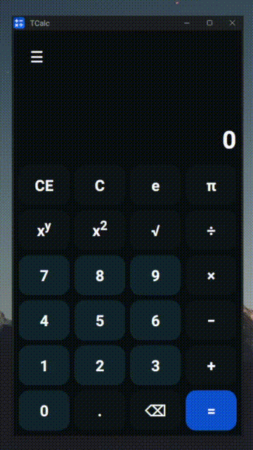

# TCalc - the Terrible Calculator

*Rome wasn't built in a day, but TCalc was!*

I was trying to get somewhat familiar with Tauri, but just ended up writing a ||expletive|| JavaScript calculator.

**Disclaimer**: I really threw this together in short order, ~~so the code quality is somewhat lacking~~. I know there are far more efficient ways to do some of the stuff in here, but this really was just to familiarize me with the `cargo`/`tauri` build toolchain (now to actually write a Rust-based backend with a full formula parse-tree--but that will be a different project). Feel free to use, abuse, modify, and redistribute (if you *dare*!).

Can compile for:

- Linux
- MacOS
- Windows
- Android (I'm told)
- iOS (Supposedly)

You will need `cargo` and `tauri`.

```bash
# Builds this horribleness
cargo tauri build

# Builds for a specific platform
cargo tauri build --target <your target>
```

Oh, here's a screenshot. Currently only dark mode supported.


